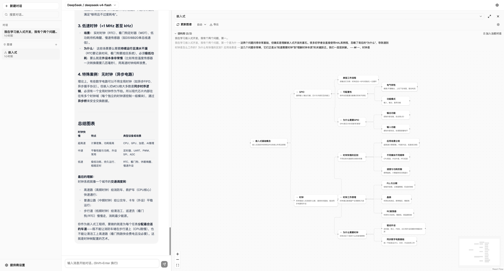
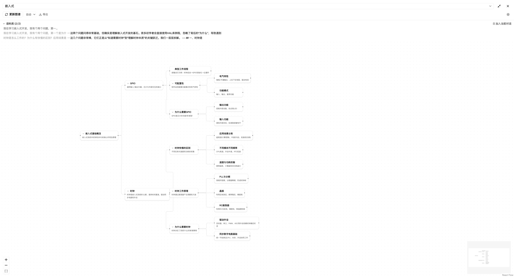
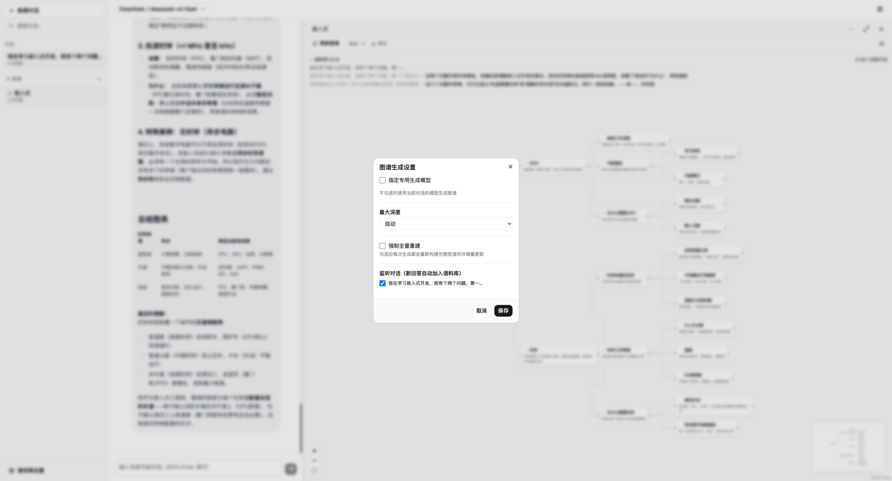

<p align="center">
  <h1 align="center">🧠 渐进式脑图 (Progressive Mindmap)</h1>
  <p align="center">
    <strong>从对话中提取结构化知识 — AI 驱动的渐进式思维导图</strong>
  </p>
  <p align="center">
    
    
    
    
  </p>
</p>

> [English README](README.md)

---

> **为什么做这个项目**：在与大模型进行了无数次对话后，我发现了一个痛点——那些精彩的回答被埋在冗长的聊天记录里，难以回溯、无法沉淀。我需要一种方式，能自动将碎片化的对话提炼成结构化的知识，随时翻阅、强化记忆。这就是渐进式脑图的由来：让散落的问答，生长为一棵会呼吸的知识树。

**渐进式脑图** 是一款本地优先的 Web 应用，能将你与 LLM 的对话自动转化为结构化的思维导图。

与传统手动绘制脑图的工具不同，渐进式脑图 **从对话中自动提取知识**：与任意兼容 OpenAI 接口的大模型对话，选择想要保留的见解，AI 会生成结构化的知识图谱——并支持 **增量更新**，你的手动编辑在多次生成之间不会被覆盖。

<p align="center">
  
</p>

## ✨ 核心特色

### 🤖 AI 原生生成
- **对话 → 知识图谱** — LLM 分析对话内容，自动生成结构化思维导图
- **增量操作** — AI 输出精准编辑指令（`add_child`、`update`、`merge`、`delete_leaf`）而非整棵树重建
- **可编辑节点** — 双击编辑，AI 会保护你的手动编辑（基于 `editedByUser` 标志）

### 📚 语料库与溯源
- **来源追溯** — 每个节点标注来自哪条对话消息
- **语料筛选** — 整条消息或文本片段级别的内容选择
- **对话监听** — 新 AI 回复自动加入脑图语料库

### 🎨 画布与交互
- **React Flow 画布** — 平滑平移/缩放，dagre 自动布局
- **拖拽重排** — 拖拽节点重新组织结构
- **右键菜单** — 添加子节点、移动、删除
- **折叠/展开** — 切换分支，聚焦查看

<p align="center">
  
</p>

### ⚙️ 可定制
- **可配置深度** — 3/4/5 层或"自动"模式
- **多厂商支持** — OpenAI / DeepSeek / Ollama / SiliconFlow 等
- **独立生成模型** — 每张脑图可使用不同的模型

<p align="center">
  
</p>

### 💾 本地优先 & 隐私保护
- **IndexedDB 存储** — 所有数据留在浏览器端
- **无需后端** — 直接从浏览器调用 API
- **无需账号** — 数据完全属于你

## 🚀 快速开始

### 环境要求
- Node.js 18+
- 任意兼容 OpenAI 接口的 API 密钥（OpenAI / DeepSeek / Ollama 等）

### 安装运行

```bash
git clone https://github.com/web4zn/progressive-mindmap.git
cd progressive-mindmap
npm install
npm run dev
```

打开 [http://localhost:5173](http://localhost:5173)，在设置中添加 API 提供商，开始对话。从侧边栏创建脑图即可开始知识提取！

## 🧪 开发

```bash
npm test              # 运行测试
npx tsc --noEmit      # 类型检查
npx vitest --watch    # 监听模式
```

## 🗺️ 路线图

- [x] LLM 多厂商对话 & 流式输出
- [x] AI 脑图生成（全量重建）
- [x] 增量更新操作
- [x] 语料库 & 来源追溯
- [x] React Flow 画布 + dagre 布局
- [x] IndexedDB 持久化
- [ ] 实时流式脑图预览（生成过程中逐步渲染）
- [ ] PNG / SVG / Markdown 导出
- [ ] 快捷键系统
- [ ] 撤销 / 重做
- [ ] 富文本节点（图片、链接、笔记）
- [ ] 插件架构
- [ ] 多布局类型（组织架构图、鱼骨图、时间线）
- [ ] 主题系统

## 🤝 贡献

欢迎贡献！请参阅 [CONTRIBUTING.md](CONTRIBUTING.md) 了解详情。

## 📄 许可证

MIT — 详见 [LICENSE](LICENSE)。
